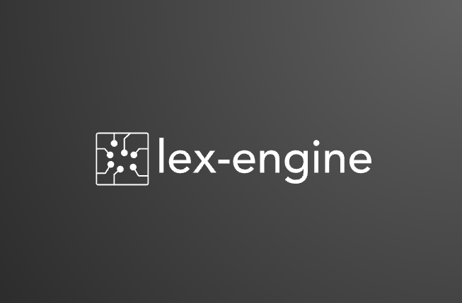

# Lex-Engine



[](http://java.oracle.com)
[](https://github.com/pradeesh-kumar/lex-engine/blob/main/LICENSE)

**Lex-Engine** is a [Lexical Analyser](https://en.wikipedia.org/wiki/Lexical_analysis) and [Parser](https://en.wikipedia.org/wiki/Parsing) generator tool to recognize a language from the given grammar and build the [Parse Tree](https://en.wikipedia.org/wiki/Parse_tree). It's written in Java.

## Supported Wildcard Characters in the Regex
```
* Matches zero or more occurrences of the preceding element
+ Matches one or more occurrences of the preceding element
? Matches exact one occurrence of the preceding element
. Matches any character
```

## How to Build
To build the packages, follow these steps:

## Contributing
Lex-Engine is free software, contributions are welcome.

Author: Pradeesh Kumar