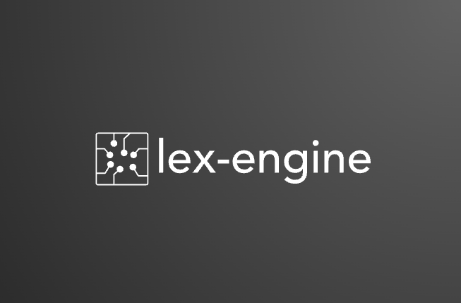

# Lex-Engine

**Lex-Engine** is a lexical analyser and parser tool to recognize a language from the given grammar and build the syntax tree. It's written in Java.

# How to Build
To build the packages, follow these steps:

# Contributing
Lex-Engine is free software, contributions are welcome.
